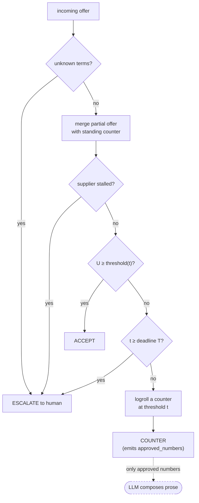
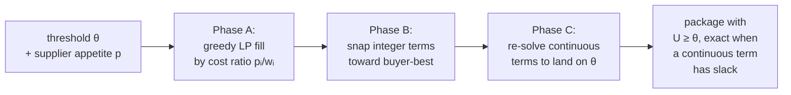

[](https://github.com/eugnmueller-87/Negotiation-Agent/actions/workflows/ci.yml)
[](LICENSE)
[](https://www.python.org/)
[](pyproject.toml)

# Negotiation Agent

**A procurement negotiation agent where the LLM has zero authority.** A deterministic
Python engine makes every accept / counter / walk-away call and fixes the exact figures
a reply may state. A language model writes the emails — and **cannot state a number the
engine didn't approve**: a violating draft is rejected and redrafted server-side before
it's ever sent. Not "the AI negotiates for you" — the AI *drafts*, the engine *decides*,
and the guarantee is mechanical, not a prompt.

### ▶ Live demo — [web-production-a5b7b.up.railway.app](https://web-production-a5b7b.up.railway.app/)

Real Opus writing negotiation emails against the real engine, deployed. Click **Sign the
mandate → Auto-play** and watch it negotiate; open **"Why this move"** to see the engine's
threshold/utility math and the guard rejecting a draft in real time.

---

## How it works — the process

The whole system is one rule applied at three seams: **the LLM advises, deterministic
code decides.** Here's the flow of a negotiation:

```
  UPLOAD A CONTRACT ──► deep extraction (regex; LLM v1) ──► supplier research (Hades)
        │                       │                                  │
        └──────────────► CONTRACT INTELLIGENCE ◄───────────────────┘
                                │
              a DETERMINISTIC rule table maps findings ──► PROPOSED MANDATE ADJUSTMENTS
              (expiry → lower the floor; no DPA → required gate; no rebate → a give-lever)
                                │
                    HUMAN REVIEWS & APPROVES the diff ──► the mandate is SIGNED (HMAC)
                                │
   ┌────────────────────────────┴────────────────────────────────────────────────┐
   │  each round, statelessly on the server:                                      │
   │  fold the transcript ► ENGINE decides accept/counter/escalate (Boulware) ►   │
   │  build a move-brief ► LLM DRAFTS the email ► GUARD checks every figure ►      │
   │  violation? ─► redraft (or a deterministic template) ─► release only if clean │
   └──────────────────────────────────────────────────────────────────────────────┘
```

**Three flows a user can drive:**

1. **Walk in prepared** *(new)* — paste the current/expiring contract. The agent extracts
   the deal (price, payment, volume, expiry, licenses, NDA/DPA, units of measure),
   researches the supplier, and proposes how the intelligence should **shape the mandate** —
   each change tagged *give / hold / hedge* with a plain rationale. You approve every one.
   Critically, the LLM never edits the envelope: a pure-Python rule table maps findings to
   bounded, reversible deltas, and a human signs the diff. *("LLM advises, code decides"
   applied to mandate construction — see [`docs/contract-intelligence-architecture.md`](docs/contract-intelligence-architecture.md).)*

2. **Watch it negotiate** — set the levers (target, floor, term weights, add/remove terms,
   supplier persona + concession pace), sign, and auto-play. The email thread fills; the
   reasoning drawer shows the engine math and the guard holding the line.

3. **Play a seat yourself** — the older self-play demos (`demo/peitho.html`,
   `demo/fleet.html`) let you type as the buyer or supplier and watch the engine react.

## Demos

- **▶ [Live v2](https://web-production-a5b7b.up.railway.app/)** — the deployed app: real
  engine + real Opus/Haiku, contract intelligence, the visible guard. This is the one to open.
- **[`demo/peitho-v2.html`](demo/peitho-v2.html)** — the same v2 UI (source); runs against
  the live backend when opened locally.
- **[`demo/fleet.html`](demo/fleet.html)** — the **1,000-supplier tail-spend fleet**, every
  negotiation a real engine run. *The scale story.*
- **[`demo/peitho.html`](demo/peitho.html)** — the original single-file self-play demo
  (engine ported to JS, offline). *The mechanism story, no backend needed.*

```text
$ neg-sim
================================================================
NEGOTIATION AGENT v0 — reference simulation
  ZOPA check (supplier U at buyer reservation): 0.750 (supplier reservation 0.50)
================================================================
OVERALL  (n=9)
  closure      88.9%   escalation  11.1%   walk   0.0%
  capture μ    0.488   min  0.414   joint μ  1.305

by belief condition:
  oracle    closure 100.0%   joint μ  1.333   ← knows supplier priorities
  uniform   closure 100.0%   joint μ  1.284   ← no information
  inverted  closure  66.7%   joint μ  1.294   ← worst-case wrong belief → escalates
```

> **The headline result** — run `neg-sim --baseline`: at *identical buyer utility*,
> logrolling leaves the supplier **+0.27 utility** better off than splitting the
> difference. Same cost to the buyer, a materially better deal for the
> counterparty. That win-win — the trade humans skip because they anchor on
> price — is the entire point, and it's a runnable, tested number, not a claim.

---

## Quickstart

```bash
python -m venv .venv && .venv/Scripts/python -m pip install -e ".[dev]"   # Windows
# python -m venv .venv && source .venv/bin/activate && pip install -e ".[dev]"   # POSIX

neg-sim                                    # the reference simulation report
neg-sim --baseline                         # logrolling vs price-split (the proof)
neg-sim --transcript ref/aggressive/oracle # replay one negotiation, turn by turn
neg-sim --json                             # machine-readable metrics

pytest -q                                  # 183 tests, all green
mypy && ruff check .                       # strict types, clean lint
```

## Watch it logroll — a real transcript

`neg-sim --transcript ref/aggressive/oracle` replays one negotiation. Watch the
engine's `threshold` decay on a Boulware schedule while `buyerU` stays pinned
high, and the supplier's `supU` climb as the engine trades away terms the buyer
weights lightly (payment days → 30, volume → 50 000, both the supplier's ideal)
while **holding price at 9** (the buyer's ideal, its heaviest weight):

```text
seq  actor    rnd  kind      threshold   buyerU   supU   reason
  0  engine     0  counter       0.950    0.950  0.150   opening_anchor
  ...
 12  engine     6  counter       0.823    0.823  0.451   counter
 14  engine     7  counter       0.716    0.716  0.632   counter
 15  supplier   8  accept            -        -  0.632
OUTCOME: closed_supplier
DEAL: price=9  payment_days=30  contract_months=19  volume_units=50000  rebate_pct=7.79
      → buyer utility 0.716
```

The engine gave the supplier almost everything it valued (`supU` 0.15 → 0.63) and
gave up almost nothing the buyer valued. That is logrolling, not haggling.

## How it works

Every negotiable term (price, payment days, contract length, volume, rebate) has
a normalized value function `vᵢ(xᵢ) ∈ [0,1]` and a weight `wᵢ`. Any offer scores
as buyer utility:

```
U = Σ wᵢ · vᵢ(xᵢ)        with Σ wᵢ = 1, so U ∈ [0,1]
```

**Acceptance** rides a Boulware concession curve — the per-round threshold decays
from `target_utility` toward `reservation_utility`, conceding *late and steeply*:

```
threshold(t) = reservation + (target − reservation) · (1 − (t/T)^β),   β > 1
```

The engine accepts iff an incoming offer's `U ≥ threshold(t)`. At the deadline
`t = T` the threshold equals reservation and the engine **escalates to a human**
rather than counter.

**Counteroffers use logrolling, not price-splitting.** At the round's threshold
the engine finds the package the supplier is likeliest to accept: it concedes on
terms the buyer weights lightly but the supplier values highly, and holds terms
the buyer weights heavily. Formally it solves a fractional-knapsack LP whose exact
optimum is a greedy fill ordered by the cost ratio `pᵢ/wᵢ` (supplier appetite ÷
buyer weight).

### The `decide()` state machine



Every `COUNTER`/`ACCEPT` emits `approved_numbers` — the **only** numeric values a
downstream LLM reply may contain. That dashed edge is the whole security model:
thresholds, utilities, and β never cross it.

### The counteroffer search (`fill_package`)



Snapping integer terms *toward the buyer's ideal* means rounding can only **add**
buyer utility — a package can never round below the threshold it was built to
clear. Phase C hands the surplus back on the terms the supplier values most.

## The logrolling proof (`neg-sim --baseline`)

The pitch is "logrolling, **not** price-splitting" — so the repo tests it against
exactly that baseline: a naive negotiator that concedes uniformly on every term,
blind to supplier preferences. At matched buyer utility:

| buyer target | logroll → supplier U | price-split → supplier U | supplier gain |
|:---:|:---:|:---:|:---:|
| 0.95 | 0.150 | 0.049 | **+0.101** |
| 0.85 | 0.400 | 0.147 | **+0.253** |
| 0.75 | 0.600 | 0.250 | **+0.350** |
| 0.65 | 0.700 | 0.348 | **+0.352** |
| 0.55 | 0.750 | 0.447 | **+0.303** |

**Mean supplier gain at matched buyer cost: +0.27.** Buyer pays the same; the
counterparty walks away with a far better deal. This is `test_baseline.py` — the
assertion `mean_gain > 0.15` fails CI if the edge ever collapses.

## Engineering judgment

Three moments worth calling out, because they're the difference between "it runs"
and "it's right":

- **A concession-curve bug caught in the spec.** The original brief had the
  Boulware exponent inverted — `(t/T)^(1/β)` with β>1 — which is a *Conceder*: it
  surrenders buyer leverage early and steeply, the opposite of the intent. The
  invariant `threshold(0)=target, threshold(T)=reservation` only behaves like a
  holdout for `(t/T)^β, β>1`. Guarded by `test_boulware_concedes_late`.
- **The numeric guard.** `approved_numbers` on every `EngineDecision` is *"the ONLY
  numeric values a downstream LLM-composed reply may contain."* An LLM sitting on
  the wire (v1) literally cannot state a price the engine didn't approve — the
  confidentiality and integrity boundary in one field.
- **Determinism as auditability.** No RNG, no wall clock, no globals; state is
  threaded explicitly. Every negotiation replays **bit-identically** from its
  transcript — the foundation of a compliance/audit story.

## Architecture

```
src/negotiation_agent/
  value.py            normalized value functions vᵢ and their inverse
  envelope.py         versioned, signed mandate: TermSpec, Offer, Envelope
  supplier_model.py   SupplierModel — belief about supplier appetite (pure data)
  packages.py         fill_package() — the logrolling LP + 3-phase integer snap
  baseline.py         uniform price-split control + head-to-head comparison
  engine.py           DealEngine — Boulware curve, accept rule, decide() FSM
  simulator/
    personas.py       aggressive / cooperative / evasive parameter sets
    supplier.py       SupplierAgent protocol + deterministic ParametricSupplier
    loop.py           run_negotiation() + Turn/Transcript/NegotiationResult
    scenarios.py      Scenario, zopa_check(), reference 3×3 matrix
    metrics.py        capture ratio, joint utility, batch aggregation
    cli.py            neg-sim: report / --baseline / --transcript / --json
```

The code to read first is [`packages.py`](src/negotiation_agent/packages.py)
(the logrolling search) and [`engine.py`](src/negotiation_agent/engine.py) (the
decision state machine).

## The eval suite

`neg-sim` runs a **3 personas × 3 belief-conditions** matrix. The belief
conditions — *oracle* (told the supplier's true priorities), *uniform* (no info),
*inverted* (worst-case misclassification) — are the sweep that isolates the value
of knowing what the counterparty wants.

Reading the reference numbers **honestly**:

- **Oracle belief captures the most joint utility** (1.333 vs uniform 1.284) — but
  the un-confounded proof is `--baseline` above, not this table: full-loop joint
  utility is muddied by each persona's own acceptance timing.
- The **cooperative** persona closes at identical joint utility across all three
  beliefs — it concedes fast enough that belief quality doesn't bite. The
  logrolling signal lives in the aggressive/evasive rows.
- **Inverted belief has the highest buyer capture (0.57)** yet lower joint utility
  — a mis-served supplier concedes more on the buyer's axis while value is left on
  the table. Capture measures where in the buyer's span the deal landed; joint
  utility measures whether it was Pareto-good.
- The single **escalation** is an evasive supplier under a wrong belief — exactly
  where an agent *should* hand off to a human buyer, not force a bad deal.

`capture_ratio = (U − reservation) / (target − reservation)`. `joint_utility`
(buyer + supplier, from the hidden supplier envelope) is the Pareto proxy. The
reference numbers are pinned to a committed fixture
([`tests/fixtures/reference_metrics.json`](tests/fixtures/reference_metrics.json))
and regression-tested, so they can't silently drift out of sync with this README.

## Theory basis

| mechanism | source |
|---|---|
| time-dependent (Boulware) concession | Faratin, Sierra & Jennings, *Negotiation decision functions* (1998) |
| logrolling / issue trade-offs | Raiffa, *The Art and Science of Negotiation* (1982) |
| ZOPA · BATNA · reservation value | Raiffa (1982); Fisher & Ury, *Getting to Yes* (1981) |
| joint-utility / Pareto proxy | Nash, *The Bargaining Problem* (1950) |

Where this diverges: the counteroffer search is an **exact** fractional-knapsack
LP rather than Faratin's similarity heuristic — deterministic and optimal for the
linear-additive utility model, which is what makes the audit replay exact.

## Roadmap

- **v0 — the deterministic core.** ✅ Envelope schema, engine, logrolling baseline,
  headless simulator, evals. Pure Python, CI-gated.
- **v1 — a live LLM-drafted negotiation.** ✅ **Deployed** at
  [web-production-a5b7b.up.railway.app](https://web-production-a5b7b.up.railway.app/).
  A stateless FastAPI backend ([`api.py`](src/negotiation_agent/api.py)): the real engine
  runs server-side, folds the transcript each turn, drafts with Opus (buyer) / Haiku
  (supplier), and enforces the **guard-with-redraft** loop
  ([`negotiate.py`](src/negotiation_agent/negotiate.py), [`guard.py`](src/negotiation_agent/guard.py))
  so a violating draft never reaches the wire. Mandates are HMAC-signed
  ([`signing.py`](src/negotiation_agent/signing.py)); a human plays either seat.
- **Contract intelligence — the "prepared buyer".** ✅ Upload a contract → extraction
  ([`intake.py`](src/negotiation_agent/intake.py), [`intelligence.py`](src/negotiation_agent/intelligence.py))
  + supplier research via the **Hades** agent ([`research.py`](src/negotiation_agent/research.py))
  → a **deterministic finding→mandate transform** ([`shaper.py`](src/negotiation_agent/shaper.py),
  21 property tests) that a human approves before signing. **Full design:**
  [docs/contract-intelligence-architecture.md](docs/contract-intelligence-architecture.md).
- **Next.** LLM contract extractor (richer clauses / NDA-DPA *absence*, behind the same
  `ContractExtractor` seam); AI-Brain integration — recall prior deals from an Obsidian
  vault and write supplier notes back (runs locally, not on the deploy — the vault is
  local); DocuSign close, Art. 50 AI-disclosure banner.

**The guarantee, everywhere:** `approved_numbers` (the drafter's allowlist), the
guard-with-redraft loop (a figure the engine didn't approve cannot ship), and the
deterministic mandate transform (findings shape the envelope, the LLM never does). The
determinism of the mandate is the product's credibility.

## License

[MIT](LICENSE).
